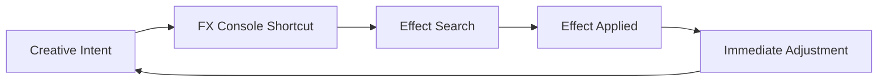

# FX Console (Video Copilot) 

There is a moment in every edit when the cursor pauses.
Not because the idea is gone — but because the interface stands in the way.

**FX Console** exists for that moment.

Invisible until summoned, quiet until needed, this plugin does not add effects — it *removes friction*. It is the breath between thought and execution, the whisper that says: *keep going*.

Developed by **Video Copilot**, FX Console has become one of the most beloved workflow accelerators inside **Adobe After Effects**, used daily by motion designers, VFX artists, and editors who value momentum as much as precision.

---

## Overview ⚡

**FX Console** is a lightweight productivity plugin that allows you to instantly search, apply, and control effects using a simple keyboard shortcut.

No panels.
No menus.
No scrolling through endless lists.

Just a command line for creativity.

At its core, FX Console is about **speed, focus, and flow** — letting your hands stay on the keyboard and your mind stay inside the composition.

---

## What FX Console Actually Does 🧠

FX Console doesn’t try to be flashy.
Its power lies in restraint.

### 🔍 Instant Effect Search

Press a shortcut. Type a few letters. Apply the effect.

* Searches all native AE effects
* Works with third-party plugins
* Learns from your usage
* Eliminates menu diving entirely

This alone can save **hours per week**.

---

### 🎯 One-Click Application

Effects are applied directly to the selected layer — no dragging, no guessing.

* Works on footage, solids, text, shapes
* Supports multiple layer selections
* Applies exactly where intended

Your timeline remains uninterrupted.

---

### 🧭 UI & Parameter Control

FX Console can open and focus effect controls instantly.

* Jump directly to effect parameters
* Toggle UI visibility
* Clean up cluttered panels

> [!NOTE]
> Less interface noise leads to better creative decisions.

---

### ⌨️ Custom Shortcuts

FX Console bends to your habits.

* Assign custom hotkeys
* Rebind default commands
* Build muscle memory that sticks

Speed becomes personal.

---

## Why FX Console Feels So Good ✨

Because it respects how artists actually work.

**Creative benefits**

* Maintains creative flow
* Reduces cognitive load
* Encourages experimentation
* Keeps attention on the frame, not menus

**Technical strengths**

* Extremely lightweight
* Stable across AE versions
* Zero impact on render times
* No background processes

FX Console doesn’t compete with your tools — it *connects* them.

---

## Typical Workflow 🌊

1. Select a layer
2. Press FX Console shortcut
3. Type effect name (e.g., “blur”, “glow”)
4. Hit Enter
5. Continue animating

No interruption.
No mental reset.
Just motion flowing forward.

---

## Flow Logic Diagram 🔁

A loop without resistance — thought feeding motion, motion feeding thought.

---

## Frequently Asked Questions ❓

**Is FX Console free?**
Yes — it’s completely free, which makes its value almost absurd.

**Does it replace After Effects panels?**
No. It complements them by removing unnecessary interaction.

**Can beginners use it easily?**
Absolutely. If you can type, you can use FX Console.

**Does it work with plugins like Trapcode or Universe?**
Yes — any installed effect is searchable.

**Is it still relevant in 2026?**
More than ever. As projects grow heavier, speed matters more.

> [!IMPORTANT]
> FX Console shines brightest when paired with strong keyboard habits.

---

## Philosophy Behind the Tool 🌌

FX Console is not about adding power — After Effects already has plenty of that.

It is about **removing delay**.

Delay between:

* Idea and execution
* Decision and result
* Curiosity and experimentation

And in that removal, something subtle happens:
you begin to trust your instincts again.

---

## Final Thoughts 🕊️

FX Console doesn’t announce itself.
It doesn’t glow, pulse, or shout.

It simply waits — ready to serve the moment inspiration strikes.

Once it becomes part of your workflow, going back feels impossible. Like editing with gloves on. Like drawing with hesitation. Like thinking through fog.

This is not a plugin you *use*.
It is a plugin you *forget about* — because it’s always there, doing exactly what it should.

Quiet speed.
Clean motion.
No interruptions.

---
